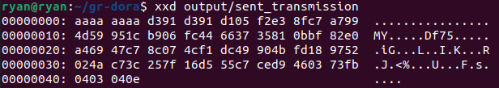
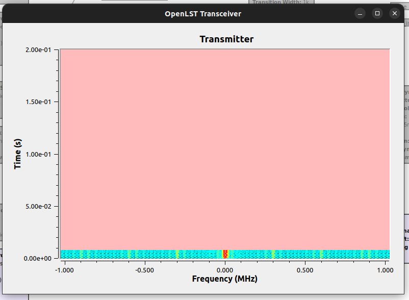

# dora-capstone

This repository contains the code and other necessary files for our capstone project.

## GNU Radio

Screenshotted below is GNU Radio transmitting a signal to DORA.

Recent progress with GNU Radio. Screenshotted is receiving live tranmission from DORA satellite, where GNU Radio is decoding the data as it comes in.

