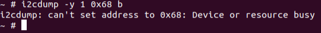

## Real time clock

According to the MBM2 datasheet, the RTC should be an i2c device: M41T81S, but I can’t find the address in the datasheets.
On the flatsat MBM2, I don’t see it:

Which compared to a BBB not on the MBM2, it has the same result (note that 57 is the ADCS)
BBB not on the MBM2:

Puting the RTC on hold and going back to setting time. This command works:
date -s '2014-12-25 12:34:56'

There's the RTC:

dmesg:

Can’t read the i2c:

Verifying that the RTC drivers installed does in fact support the M41T81S module:

